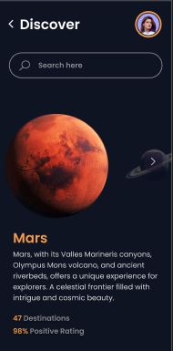
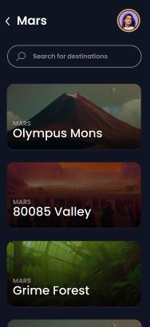
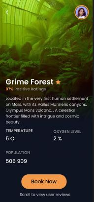
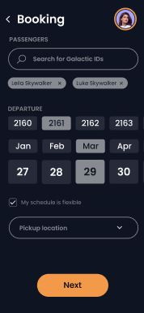
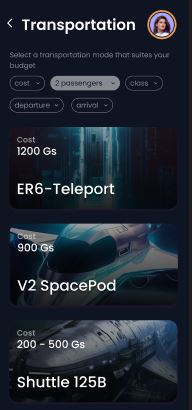
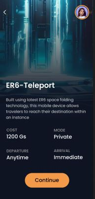
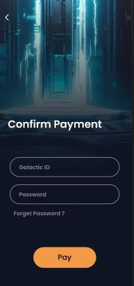
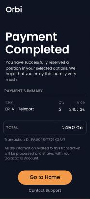

# Orbi - React Native App

Orbi is your gateway to interplanetary travel. Discover celestial destinations, seamlessly book your journey, and enjoy personalized space adventures. With cutting-edge technology, educational insights, and a thriving community of explorers, Orbi makes exploring the universe a reality. Join us on a voyage of a lifetime today!
## About

Our mission is to make interplanetary travel accessible and enjoyable for everyone. Whether you dream of walking on the Martian surface, exploring the mysteries of distant planets, or witnessing the beauty of celestial bodies, our app is designed to fulfill your space travel aspirations.

## Features

- Discover places according to your preferences and get suggestions based on what you and others have travelled
- Choose a transportation mode according to your budget and other preferences
- Keep track of your trips
- Secure payments

## Backend services

- [orbi.backend](https://github.com/byte3org/orbi.backend) - The backend
- [galactic.wallet](https://github.com/byte3org/galactic.wallet) - Wallet service
- [oidc-orbi](https://github.com/byte3org/oidc-orbi) - Openid server

## Current limitations

- Currently we do not track weather so no weather forecasting
- An endpoint for shuttle schedules is not available yet
- Recommendations are not generated for the user that is the using the app currently

## Screenshots

### Booking Function Workflow

This document outlines the workflow for the booking function in our application. Follow these steps to seamlessly book interplanetary travel tickets using our app.

#### Step 1: Discover the Planet of Your Wish

- **Description:** Begin your journey by discovering your dream interplanetary destination.
- **Screenshot:** 

#### Step 2: Destination Selection

- **Description:** Choose your desired destination from a diverse range of options.
- **Screenshot:** 

#### Step 3: Explore Destination Details

- **Description:** Dive into the details of your chosen destination, learning about its unique features and attractions.
- **Screenshot:** 

#### Step 4: Select Passengers, Departure Date, Pickup Location

- **Description:** Customize your journey by specifying the number of passengers, departure date, and pickup location.
- **Screenshot:** 

#### Step 5: Select Transportation Mode

- **Description:** Choose your preferred mode of transportation for the trip.
- **Screenshot:** 

#### Step 6: Check Transportation Mode Details

- **Description:** Review the details of your selected transportation mode, ensuring it aligns with your preferences.
- **Screenshot:** 

#### Step 7: Confirm Booking and Proceed to Payment

- **Description:** Confirm your booking and proceed to the secure payment gateway for transaction completion.
- **Screenshot:** 

#### Step 8: Payment Confirmation with Biometrics

- **Description:** Verify your payment using biometric authentication for enhanced security.
- **Screenshot:** 

#### Step 9: Payment Confirmation with Galactic ID and Password

- **Description:** Alternatively, confirm your payment by entering your Galactic ID and secure password.
- **Screenshot:** 

#### Step 10: Get Payment Invoice

- **Description:** Receive a detailed payment invoice with all the booking and payment transaction information.
- **Screenshot:** 

#### Troubleshooting

If you encounter any issues during the booking process, refer to our FAQ section or contact our support team for assistance.

Happy booking, and enjoy your interplanetary adventure with us!

## Getting Started


Follow these steps to run the Interplanetary Travel Booking App on your local machine.

## Prerequisites

Before you begin, ensure you have met the following requirements:

- Node.js and npm (Node Package Manager) installed. [Download Node.js](https://nodejs.org/)
- Expo CLI installed globally. You can install it using npm:

```npm install -g expo-cli```


- A code editor of your choice. We recommend [Visual Studio Code](https://code.visualstudio.com/) with the Expo extension for the best development experience.

## Installation

1. Clone this repository to your local machine:


```git clone https://github.com/byte3org/orbi.frontend.git```


2. Navigate to the project directory:

```cd interplanetary-travel-app```


3. Install project dependencies:

```npm install```

4. If you are going to work with the backend, you will need to clone the following repo as well

```git clone https://github.com/byte3org/orbi.backend```

Check out the [backend](https://github.com/byte3org/orbi.backend) for more information about how to set up


## Running the App

Now that you have the app and its dependencies installed, you can run it using Expo. Make sure you're in the project directory.

1. Start the Expo development server:

```expo start```


2. A new window or tab will open in your default web browser, displaying the Expo Developer Tools. Here, you can choose to run your app on an Android or iOS simulator/emulator, or you can use the Expo Go app on your physical device to scan the QR code and run the app.

## Testing on a Physical Device

To run the app on your physical device, follow these additional steps:

1. Download the "Expo Go" app from the [App Store](https://apps.apple.com/us/app/expo-go/id982107779) (for iOS) or [Google Play Store](https://play.google.com/store/apps/details?id=host.exp.exponent) (for Android).

2. Open the Expo Go app on your device.

3. Scan the QR code displayed in the Expo Developer Tools in your browser.

4. Your app will be loaded on your device for testing.

## Congratulations!

You have successfully set up and run the Interplanetary Travel Booking App on your local machine. Happy exploring!

